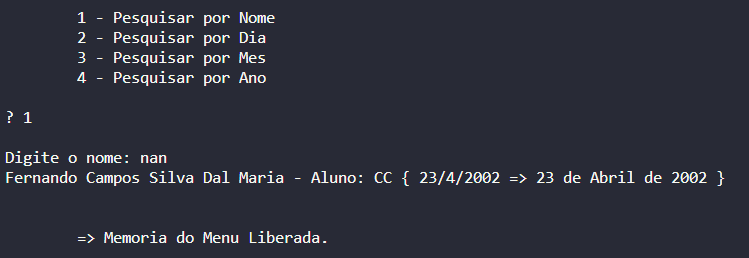

# Algorítimos e Estrutura da Dados I

## Trabalho Prático

> Discente: Fernando Campos Silva Dal Maria (matrícula: 765053);
> 
> Orientador: Dr. Lúcio Mauro Pereira.

## Diretivas Sobre o Trabalho:

Este projeto contém os seguintes arquivos de cabeçalho: `Aluno.hpp`, `Data.hpp`, `Database.hpp`, `Menu.hpp`, `Pessoa.hpp` e `Professor.hpp`, declaram as classes utilizadas no programa. Cada um desses arquivos apresenta o mesmo nome da classe para facilitar a compreensão e a navegação no código.

Veja abaixo as técnicas e características de cada uma das classes:

- Data: classe concreta;
- Pessoa: classe base, abstrata - criada com composição;
- Aluno: classe derivada, concreta - herda a classe Pessoa;
- Professor: classe derivada, concreta - herda a classe Pessoa;
- Menu: classe base - utilizada para manipulação dos menus;
- Database: classe base - utilizada para realizar operações com um vetor contendo ponteiros de pessoa (composição com a classe Pessoa).

### Diagrama:

### Funcionamento do Programa:

O programa inicia com o menu principal instanciado em um método da classe `Database`. 

> Menu Principal
> 
> 

A partir do menu principal é possível acessar a todos os recursos solicitados nas instruções para o trabalho. 

Ao digitar a opção `1` ao lado do indicador `?` o usuário ira acessar o menu para cadastro de entidades.

> Menu Cadastro
> 
> 

Nesse menu o usuário pode cadastrar um professo ou um aluno, veja o exemplo abaixo:

> Cadastro de Aluno
> 
> 

Observe que após o cadastro do aluno uma mensagem aparece na tela: `=> Memoria do Menu Liberada.`

Para compreender o porque dessa mensagem, lembre-se de que os menus utilizados no trabalho são objetos criados com o uso da classe `Menu`. Sendo assim, como todos os os objetos foram instânciados com o uso do operador `new`, é necessário liberar a memória alocada para o menu, através do operador `delete`, quando ele não tem mais finalidade para o programa.

**Observação:** mensagens como essa só estão presentes para facilitar a visualização do que está ocorrendo no código. 

Veja mais um exemplo:

> Cadastro de Professor
> 
> 

Ao digitar `2` o usuário receberá a listagem de todos os objetos de Professor e Aluno:

> Listagem
> 
> 

Ao digitar `3` o usuário terá acesso a outro menu, o menu de pesquisa:

> Menu de Pesquisa
> 
> 

O menu de pesquisa fornece 4 funcionalidades, pesquisar por: `nome`, `dia`, `mes`, `ano`. Todas as pesquisas estão funcionando adequadamente e são intuitívas, entretanto uma ressalva é válida quanto à pesquisa por nome. A pesquisa por nome permite que o usuário pesquise uma string qualquer e receba todos os objetos cadastrados que apresentem aquela string contida no nome da pessoa (atributo `private: nome` dos objetos Aluno e Professor).

Veja o código da função (pertencente a classe `Pessoa`) responsável por permitir essa funcionalidade:

~~~cpp
bool nameIncludes(std::string str) {
    std::string nome = this->getName();

    for(int i = 0; i < str.length(); i++) 
        if((int)str[i] < 91) 
            str[i] = (char)((int)str[i] + 32);

    for(int h = 0; h < nome.length(); h++) 
        if((int)nome[h] < 91) 
            nome[h] = (char)((int)nome[h] + 32);

    bool valido;
    for(int i = 0, j = 0; i < nome.length(); i++) {
        valido = str[j] == nome[i];

        if(valido) j++;

        if(j == str.length()) i = nome.length();
        
        if(j != 0 && !valido) {
            j = 0;
            i -= j;
        }
    } return valido;
}

//essa função retorna um valor booleano comprovando que a string str está contida em this->getNome();
~~~

> Exemplo de pesquisa por nome
> 
> 

> Exemplo de pesquisa por nome com case insensitive
> 
> 

Por fim, ao digitar `0` no menu principal, o usuário sai do progama.

> Finalizando...
> 
> 

## Código para compilação:

### Caso esteja em outro diretório

Mude para o diretório `project`.

~~~cmd
cd project
~~~

### Caso contrário

~~~cmd
g++ main.cpp Data.cpp Menu.cpp Pessoa.cpp Aluno.cpp Professor.cpp Database.cpp -o main.exe

g++ main.cpp Data.cpp Menu.cpp Pessoa.cpp Aluno.cpp Professor.cpp Database.cpp -o main.out
~~~

## Agradecimentos:

Deixo meus agradecimentos ao meu orientador Lúcio Mauro Pereira, por lecionar e atuar de forma exemplar durante os seis meses de duração da disciplina de Algorítimos e Estrutura de Dados I, a qual compareci como discente durante o primeiro semestre de 2022.
